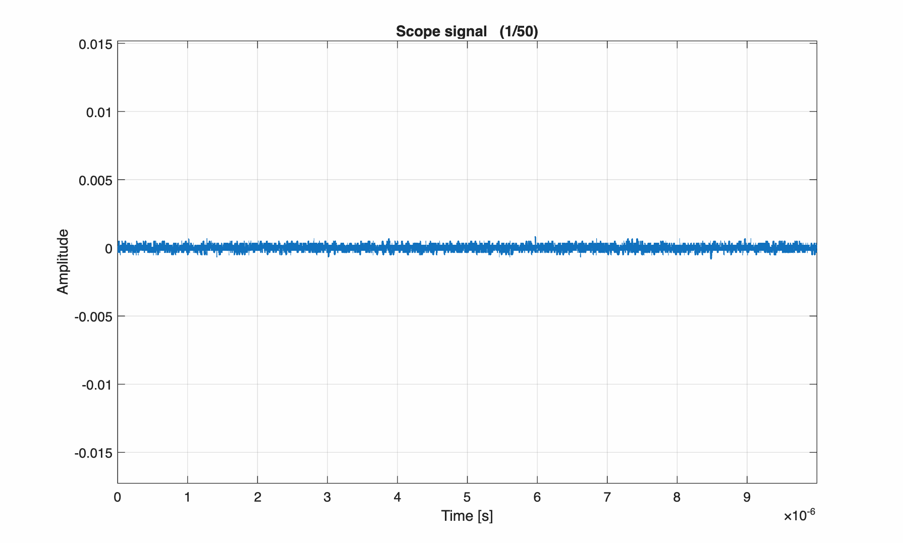

# Integration of OSA with AOTF for Scanning Through Optical Signals

This platform integrates an optical spectrum analyzer (OSA) with an acousto-optic tunable filter (AOTF) to scan through the optical signal and locate the most sensitive part of the reflectivity spectrum.

## Overview

The process has two main stages:

1. **AOTF calibration.** The AOTF must first be calibrated to establish the relationship between the RF frequency sent and the peak wavelength extracted. Because the AOTF acts like a grating, the extracted wavelength depends on the alignment between the optical axis of the AOTF crystal and that of the input optical beam. As a result, the AOTF must be recalibrated whenever it is moved.

2. **Sensitivity detection.** Once calibrated, the system precisely detects the most sensitive part of the spectrum — the region that yields a high SNR and low NEP. At this stage the oscilloscope detects the pressure via a photodetector, the pulse-echo system is switched on, and an ultrasound wave is generated at the specific amplitude and frequency we want to measure through the optical signal.

The following code automates this process, using a fine AOTF filtering step size to precisely locate the most sensitive part of the spectrum:

## Code Structure

| File | Description |
|------|-------------|
| `aotf_calibration_wavepond_yokogawa_scope.m` | Main script |
| `YokogawaOSA.m` | Optical spectrum analyzer (OSA) class |
| `wavepond.m` | Wave generator class |
| `T3DSO2502A.m` | Oscilloscope class |
| `animation_OSASpctra.m` | Plots the spectrum with the filter as a GIF |
| `animation_opticalSig.m` | Plots the optical signal with the filter as a GIF |

## Results

   
  <em>Figure 1 — Reflectivity spectrum with AOTF filtering.</em>

   
  <em>Figure 2 — Optical signal at different filtered positions.</em>

